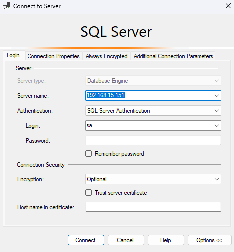

# DBM1 - Administrer un SGBD SQL Server

> Fanha Yann
> SI-T2b


***
# 1. Installer SQL Server
## 1.1 Questionnaire

1. Quelle édition de SQL Server est disponible gratuitement ?
>	Developer (et express)
2. Quelles propriétés doit posséder le compte d'utilisateur Windows utilisé pour les services SQL Server ?
>	B. Appartenir au groupe des administrateurs du poste
>	D. Être un compte d'utilisateur défini localement

3. Si deux instances SQL Server sont installées sur le même poste, combien d'instances du service SQL Server Agent vont être définies:
>	2

4. Le service d'indexation de texte intégral est-il commun à toutes les instances installées sur le poste ?
>	oui

5. Quelles éditions de SQL Server permettent d'être abonné à un service de réplication ?
>	...
1. Quel programme faut-il lancer pour installer une nouvelle instance de SQL Server?
>	Ajout/suppression de programmes depuis le panneau de configuration
>	Setup.exe depuis le DVD d'installation de SQL Server
7. Quel est le mode de sécurité défini par défaut lors de l'installation d'une instance de SQL Server ?
>	Mode de sécurite Windows

9. Quelle base d'exemple est installée de façon automatique sur toute nouvelle instance de SQL Server 2016 ?
>	Aucune
***
## 1.2 Laboratoire
### Choix de l'édition
SQL 2022 sera installé sur une machine Ubuntu 22.04. Ce choix ce justifie par la fiabilité du système ubuntu ainsi que les conseils microsoft (voir source).
### Installer une instance de SQL Server sur Linux

```bash
sudo su
wget https://packages.microsoft.com/keys/microsoft.asc -O /etc/apt/keyrings/mssql2022.key
wget https://packages.microsoft.com/config/ubuntu/22.04/mssql-server-2022.list -O /etc/apt/sources.list.d/mssql-server-2022.list
wget https://packages.microsoft.com/config/ubuntu/22.04/prod.list -O /etc/apt/sources.list.d/msprod.list
exit
```
```bash
cat <<EOM | sudo tee -a /etc/apt/sources.list.d/mssql-server-2022.list
deb [signed-by=/etc/apt/keyrings/mssql2022.key arch=amd64,armhf,arm64] https://packages.microsoft.com/ubuntu/22.04/mssql-server-2022 jammy main
EOM

cat <<EOM | sudo tee -a /etc/apt/sources.list.d/msprod.list
deb [signed-by=/etc/apt/keyrings/mssql2022.key arch=amd64,armhf,arm64] https://packages.microsoft.com/ubuntu/22.04/prod jammy main
EOM

sudo apt update
sudo apt -y install mssql-server mssql-tools unixodbc-dev

# Accept license terms (2x)
```
#### Initial setup
```bash
/opt/mssql/bin/mssql-conf setup
```
Chose _Developer_ edition for free version and Agree to the license and set an admin password.
```bash
systemctl status mssql-server --no-pager
```
#### Pare-feu ubuntu
```bash
ufw allow 1433
```

<div class="page-break" />

### Microsoft SQL Server Management Studio
Télécharger le logiciel [ici](https://learn.microsoft.com/en-us/sql/ssms/download-sql-server-management-studio-ssms?view=sql-server-ver16)
#### Connexion au serveur MSSQL

### Installer la base d'exemple
Télécharger le [fichier SQL](https://github.com/Microsoft/sql-server-samples/releases/download/adventureworks/AdventureWorks2022.bak) sur le server MSSQL puis déplacer le sous `/var/opt/mssql/data/`.
```
```bash
wget https://github.com/Microsoft/sql-server-samples/releases/download/adventureworks/AdventureWorks2022.bak

sudo mv AdventureWorks2022.bak /var/opt/mssql/data/
sudo ls /var/opt/mssql/data/
```
```bash
AdventureWorks2022.bak  mastlog.ldf   model_msdbdata.mdf          model_replicatedmaster.mdf  tempdb2.ndf
Entropy.bin             modellog.ldf  model_msdblog.ldf           msdbdata.mdf                tempdb.mdf
master.mdf              model.mdf     model_replicatedmaster.ldf  msdblog.ldf                 templog.ldf
```

Puis, se connecter avec SSMS et exécuter les commandes suivantes
```SQL
USE [master]

RESTORE DATABASE AdventureWorks2022
FROM disk= '/var/opt/mssql/data/AdventureWorks2022.bak'
WITH MOVE 'AdventureWorks2022'
TO '/var/opt/mssql/data/AdventureWorks2022.mdf',
MOVE 'AdventureWorks2022_Log'
TO '/var/opt/mssql/data/AdventureWorks2022.ldf'
,REPLACE
```
### Installation d'un AD Windows
```PowerShell
Install-WindowsFeature AD-Domain-Services
Import-Module ADDSDeployment
Install-ADDSForest `
-CreateDnsDelegation:$false `
-DatabasePath "C:\Windows\NTDS" `
-DomainMode "WinThreshold" `
-DomainName "fanha.local" `
-DomainNetbiosName "FANHA" `
-ForestMode "WinThreshold" `
-InstallDns:$true `
-LogPath "C:\Windows\NTDS" `
-NoRebootOnCompletion:$false `
-SysvolPath "C:\Windows\SYSVOL" `
-Force:$true
```
## Conclusion


## Sources

- [SQL Server 2022 : Install](https://www.server-world.info/en/note?os=Ubuntu_22.04&p=mssql2022&f=1)
- [Getting Started with SQL Server 2022 on Ubuntu 22.04](https://www.sqltabletalk.com/?p=72)
- [Installation guidance for SQL Server on Linux](https://learn.microsoft.com/en-us/sql/linux/quickstart-install-connect-ubuntu?view=sql-server-ver16&tabs=ubuntu2204)
- [Install AdventureWorks OLTP from backup](https://github.com/microsoft/sql-server-samples/blob/master/samples/databases/adventure-works/README.md)